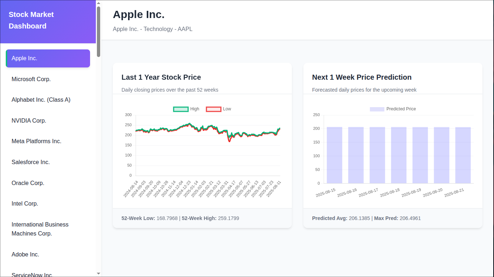

# Stock Market Dashboard

A comprehensive web application that displays real-time stock market data with predictive analytics capabilities. The dashboard provides historical stock prices for the last year and predicts future prices for the next 7 days using machine learning algorithms.



## 🌟 Features

- **Real-time Stock Data**: Live stock prices fetched from Yahoo Finance
- **Historical Analysis**: View 1-year historical data for various companies
- **Price Prediction**: 7-day future price predictions using linear regression
- **Interactive Charts**: Dynamic visualizations using Chart.js
- **Smart Caching**: Multi-layer caching system (memory + disk + LRU cache)
- **Rate Limiting**: API protection with slowapi
- **Responsive Design**: Clean, modern UI with HTML/CSS/JavaScript

## 🚀 Live Demo

**Application**: [https://sparkly-begonia-3aca77.netlify.app/](https://sparkly-begonia-3aca77.netlify.app/)

## 🛠️ Tech Stack

### Backend
- **FastAPI**: High-performance Python web framework
- **yfinance**: Yahoo Finance API for live stock data
- **SQLite3**: Local database for data persistence
- **slowapi**: Rate limiting middleware
- **scikit-learn**: Linear regression for price prediction

### Frontend
- **HTML5/CSS3/JavaScript**: Vanilla web technologies
- **Chart.js**: Interactive charting library

### DevOps
- **Docker**: Containerization
- **Docker Compose**: Multi-container orchestration

## 🏗️ Architecture

### Frontend Flow
1. User opens the application
2. Company list is fetched and displayed
3. Stock data for each company is pre-loaded and cached in memory
4. When user selects a company, data is served from cache or API call is made

### Backend Flow
1. API request received for company data
2. Check LRU cache (max size: 128) first
3. If not in cache, check disk storage (updated daily)
4. If data is stale, fetch from Yahoo Finance API
5. Store in disk and cache, then return response

### Prediction System
- Uses historical data stored on disk
- Applies linear regression algorithm
- Generates 7-day price predictions
- Results cached in both LRU cache and disk storage

## 📦 Installation & Setup

### Using Docker (Recommended)

```bash
git clone https://github.com/ShivangSrivastava/stock-dashboard
cd stock-dashboard

# Edit frontend/main.js and update the API URL
# Change: const API_URL="https://stock-dashboard-wrci.onrender.com" 
# To: const API_URL="http://backend:8000"

docker-compose up -d
```

The application will be available at `http://localhost:80`

### Manual Setup

```bash
git clone https://github.com/ShivangSrivastava/stock-dashboard
cd stock-dashboard

# Edit frontend/main.js and update the API URL
# Change: const API_URL="https://stock-dashboard-wrci.onrender.com"
# To: const API_URL="http://localhost:8000"
```

#### Backend Setup

**Option 1: Using uv (Recommended)**
```bash
cd backend
uv sync
uv run fastapi dev
```

**Option 2: Traditional Python**
```bash
cd backend
python3 -m venv .venv
source .venv/bin/activate  # On Windows: .venv\Scripts\activate
pip install -r requirements.txt
fastapi dev
```

#### Frontend Setup
```bash
cd frontend
python3 -m http.server 8080
```

Access the application at `http://localhost:8080` with the backend running on `http://localhost:8000`

## 📚 API Documentation

### Get Companies List
```http
GET /api/list
```

**Response:**
```json
{
  "AAPL": {
    "company": "Apple Inc.",
    "sector": "Technology"
  },
  "MSFT": {
    "company": "Microsoft Corp.",
    "sector": "Technology"
  },
    ...
}
```

### Get Stock History
```http
GET /api/history/{ticker}
```

**Parameters:**
- `ticker` (string, required): Stock ticker symbol (e.g., "AAPL")

**Response:**
```json
{
  "data": [
    {
      "Date": "2024-08-14",
      "Close": 220.69,
      "High": 221.99,
      "Low": 218.68,
      "Open": 219.54,
      "Volume": 41960600
    },
    ...
  ],
  "max52": 259.17,
  "min52": 168.79
}
```

### Get Price Predictions
```http
GET /api/predict/{ticker}
```

**Parameters:**
- `ticker` (string, required): Stock ticker symbol (e.g., "AAPL")

**Response:**
```json
{
  "ticker": "AAPL",
  "predictions": [
    {
      "date": "2025-08-14",
      "predicted_price": 206.20
    },
    ...
  ]
}
```

## 💡 Development Approach

This project follows a pragmatic approach to building a full-stack financial application. The architecture emphasizes performance through intelligent caching strategies and data persistence. The backend implements a three-tier caching system: in-memory LRU cache for frequently accessed data, disk storage for persistent daily updates, and live API calls as a fallback.

The frontend prioritizes user experience with preemptive data loading and smooth interactions. By caching company data in browser memory, the application provides instant responses to user selections while maintaining data freshness through strategic API calls.

The prediction system uses linear regression on historical data, providing users with insights into potential future price movements. While simple, this approach offers transparency and reasonable accuracy for short-term predictions.

## 🔧 Technologies Used

The technology stack was chosen for optimal performance and developer experience. FastAPI provides high-performance API capabilities with automatic documentation generation. The vanilla JavaScript frontend keeps the bundle size minimal while Chart.js handles complex data visualizations elegantly.

Docker containerization ensures consistent deployment across different environments, while the SQLite database provides reliable local storage without complex setup requirements. The yfinance library offers robust access to real-time market data from Yahoo Finance.

## 🚧 Challenges Faced

The main technical challenges involved optimizing data flow and caching strategies. Implementing an efficient multi-layer cache required careful consideration of data freshness vs. performance trade-offs.

Frontend chart integration presented initial difficulties with data formatting and real-time updates, which were resolved through careful state management and Chart.js configuration.

Docker deployment required switching from Python 3.11 to Python 3.10 due to compatibility issues with some dependencies, highlighting the importance of tested deployment environments.

## 📄 License

This project is open source and available under the [MIT License](LICENSE).

